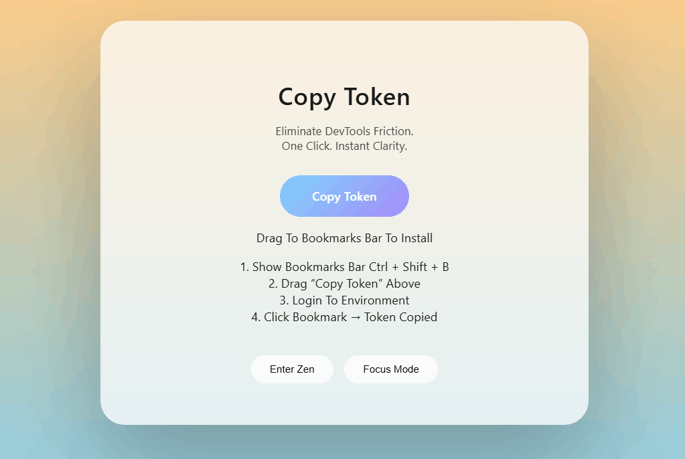

  

<h1 align="center">Copy Token</h1>

  <strong>Eliminate DevTools friction.</strong> 
  One click. Instant token.

  
  
  
  

---

## ✨ What Is This?

**Copy Token** is a premium bookmarklet utility that lets you extract JWT tokens from any logged-in web application — instantly.

No DevTools.  
No Network tab hunting.  
No Storage inspection.  

Just one click.

---

## 🚀 Why It Exists

Developers constantly:

- Open DevTools  
- Go to Network  
- Find a request  
- Copy the Authorization header  
- Paste into Swagger / Postman  

This happens dozens of times a day.

Copy Token eliminates that friction.

---

## 🔥 Features

- 🔐 Detects JWT tokens from `localStorage` and `sessionStorage`
- ⚡ One-click silent clipboard copy
- 🧘 Immersive Zen mode
- 🎯 Deep Focus mode
- 🌌 Animated sunrise → sunset → night sky
- ❄ Snow intensity control (Zen only)
- 🌠 Shooting stars + aurora shimmer
- 🎧 Optional ambient soundscape
- 💎 Premium glass UI

---

## 📦 Installation

### 1️⃣ Open the Installer Page

Open the `index.html` file in your browser.

### 2️⃣ Show Your Bookmarks Bar

